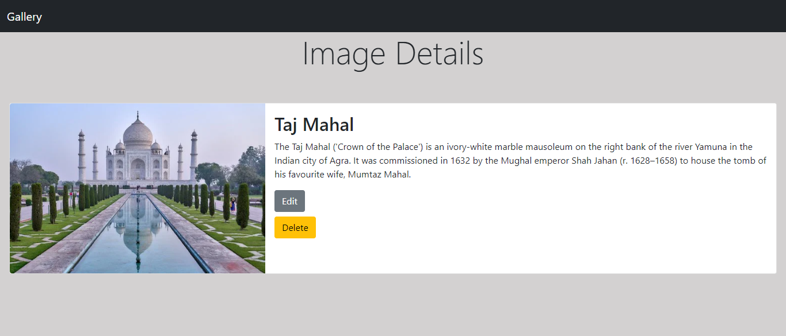
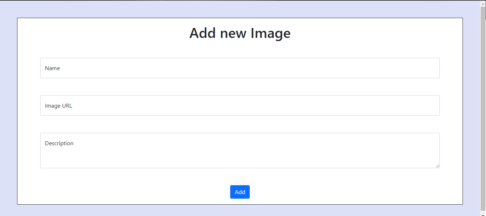

# Gallery CRUD app
A Responsive Node, Express app that allows the users to view, create, edit or delete Images

<!-- Deployed Links -->

(Heroku) Deployed Link:
<br />
http://gallerycrud.herokuapp.com/

<!--  Features -->
# Features
1. Add Images 
2. Edit Images 
3. Delete Images
4. View a specific Image and its detail.


<!-- Tech used -->
# Tech Used

| Pseudo Full Stack   | DataBase              |
| ------------------- | --------------------- |
| NodeJS              | MongoDB               | 
| ExpressJS           |                       | 
| mongoose            |                       | 
| Bootstrap           |                       | 
| EJS                 |                       |

<!-- Snippets -->
# Snippets
## Home Page

## Details Page

 
## Add Image Page



# Deployement:-

### 1. Clone the repo to your PC.
```sh
$ git clone https://github.com/htrahddis-hub/GalleryCRUD.git
```

### 2. Install the required module to the todolist-app directory
```sh
$ npm install 
```
### 3. Run the app
```sh
$ npm start
```
### 4. You will be required to give your credential to the MongoDB server or setup a local mongoDB [connection](https://docs.mongodb.com/guides/server/drivers/):